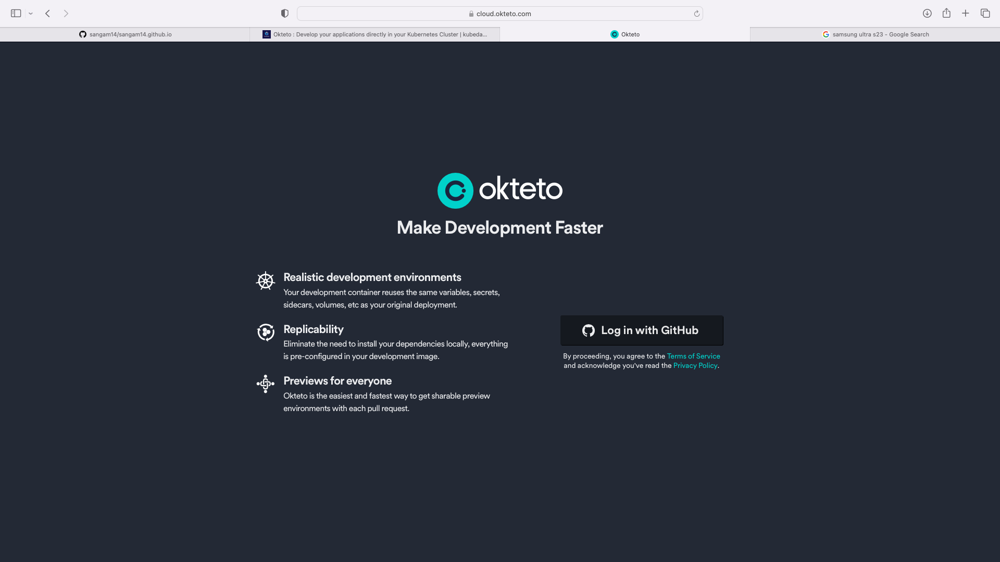
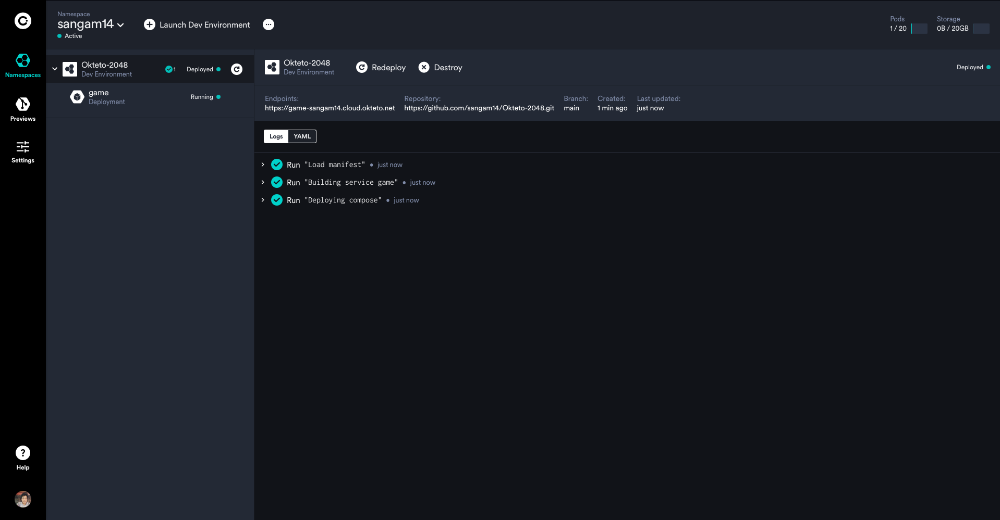
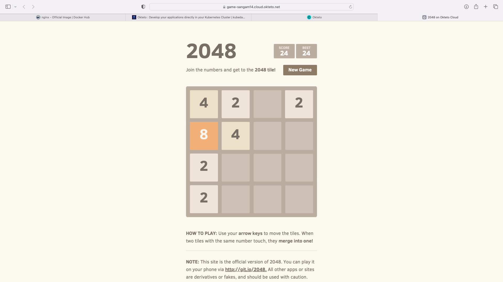
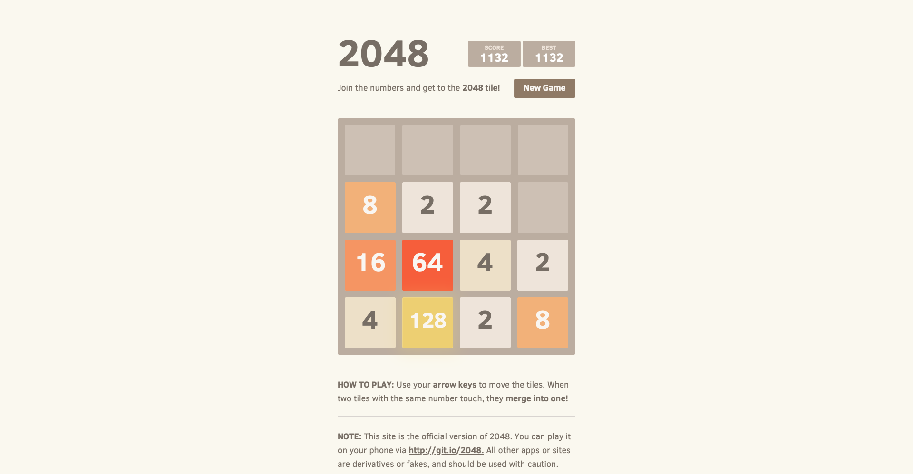

+++
author = "Sangam Biradar"
categories = ["Kubernetes", "2017"]
weight = 10
description = " Reduce Inner Loop focus on Developing Application "
draft = false
slug = "Develop your applications directly in your Kubernetes Cluster"
tags = ["DevOps", "kubernetes", "DevTool", "cloud native"]
title = "Okteto : Develop your applications directly in your Kubernetes Cluster"
[cover]
image = "okteto.png"

+++

<center> <a href="https://github.com/okteto/okteto"> </a> </center>


### Getting started with Oketo CLI  

- Macos/Linux 

```bash

➜ curl https://get.okteto.com -sSfL | sh
> Using Release Channel: stable
> Using Version: 2.14.0
> Downloading https://downloads.okteto.com/cli/stable/2.14.0/okteto-Darwin-arm64
  % Total    % Received % Xferd  Average Speed   Time    Time     Time  Current
                                 Dload  Upload   Total   Spent    Left  Speed
100 74.8M  100 74.8M    0     0  20.0M      0  0:00:03  0:00:03 --:--:-- 20.0M

```

### Login into Okteto Cloud via Github Account 




### Configuring Okteto CLI with Okteto Cloud

```bash

➜   okteto context
A context defines the default cluster/namespace for any Okteto CLI command.
Select the context you want to use:
Use the arrow keys to navigate: ↓ ↑ → ← 
  ▸ https://cloud.okteto.com (Okteto Cloud) *
    docker-desktop
    minikube
    multinode-pod-security
    
    Create new context
```
Or use directly 

```bash
➜ okteto context use https://cloud.okteto.com
 ✓  Using sangam14 @ cloud.okteto.com
```

2048 folder contain source code for 2048 

```Dockerfile
FROM nginx

COPY 2048 /usr/share/nginx/html

EXPOSE 80

CMD ["nginx", "-g", "daemon off;"]
```

```Docker-Compose.yml
services:
 game:
    build: ./
    expose:
      - 8080:80
```
### Deploy Docker Compose on Okteto Cloud 

okteto use [compose-spec](https://github.com/compose-spec/compose-spec) also its convert docker compose to kubernetes Manifest 

here is more about docker compose on okteto (https://www.okteto.com/docs/reference/compose/) 

```bash
okteto deploy --build 
 i  Using sangam14 @ cloud.okteto.com as context
 i  Building 'Dockerfile' in tcp://buildkit.cloud.okteto.net:443...
[+] Building 7.8s (7/7) FINISHED                                                                                          
 => [internal] load build definition from buildkit-3366967893                                                        0.9s
 => => transferring dockerfile: 137B                                                                                 0.8s
 => [internal] load .dockerignore                                                                                    0.7s
 => => transferring context: 2B                                                                                      0.6s
 => [internal] load metadata for docker.io/library/nginx:latest                                                      1.1s
 => [internal] load build context                                                                                    2.5s
 => => transferring context: 603.29kB                                                                                2.5s
 => CACHED [1/2] FROM docker.io/library/nginx@sha256:2ab30d6ac53580a6db8b657abf0f68d75360ff5cc1670a85acb5bd85ba1b19  0.0s
 => => resolve docker.io/library/nginx@sha256:2ab30d6ac53580a6db8b657abf0f68d75360ff5cc1670a85acb5bd85ba1b19c0       0.0s
 => [2/2] COPY 2048 /usr/share/nginx/html                                                                            0.3s
 => exporting to image                                                                                               2.5s
 => => exporting layers                                                                                              0.1s
 => => exporting manifest sha256:79f1385595d70b82b4b5db52f5edddb1f4a06c79ded928926d48bb947a5322b6                    0.0s
 => => exporting config sha256:ecf1dac7fbfaa6cdcb88dd2bbc616edbbc96459b078f15199fe3ddd564c481de                      0.0s
 => => pushing layers                                                                                                1.6s
 => => pushing manifest for registry.cloud.okteto.net/sangam14/okteto-2048-game:okteto@sha256:79f1385595d70b82b4b5d  0.8s
 ✓  Image 'registry.cloud.okteto.net/sangam14/okteto-2048-game:okteto' successfully pushed
 ✓  Kubernetes service 'game' created
 ✓  Endpoint 'game' created
 ✓  Service 'game' created
 ✓  Compose 'Okteto-2048' successfully deployed
 ✓  Development environment 'Okteto-2048' successfully deployed
 i  Run 'okteto up' to activate your development container

```

### Check it out Okteto Cloud 

Okteto basically use technic all 




### Check it out enpoints 

you will see application running 



### lets same app using kubernetes 

okteto also provide capablities to build docker images remotely its means without installing docker you can now build docker images .

```bash 

➜  okteto build -t sangam14/okteto-2048-game:okteto .
 i  Building 'Dockerfile' in tcp://buildkit.cloud.okteto.net:443...
[+] Building 5.9s (8/8) FINISHED                                                                                          
 => [internal] load build definition from buildkit-3724659360                                                        1.5s
 => => transferring dockerfile: 180B                                                                                 1.5s
 => [internal] load .dockerignore                                                                                    0.9s
 => => transferring context: 2B                                                                                      0.8s
 => [internal] load metadata for docker.io/library/nginx:latest                                                      0.9s
 => CACHED [1/3] FROM docker.io/library/nginx@sha256:2ab30d6ac53580a6db8b657abf0f68d75360ff5cc1670a85acb5bd85ba1b19  0.0s
 => => resolve docker.io/library/nginx@sha256:2ab30d6ac53580a6db8b657abf0f68d75360ff5cc1670a85acb5bd85ba1b19c0       0.0s
 => [internal] load build context                                                                                    0.9s
 => => transferring context: 4.66kB                                                                                  0.5s
 => [2/3] RUN chmod +x /usr/sbin/nginx                                                                               0.9s
 => [3/3] COPY 2048 /usr/share/nginx/html                                                                            0.3s
 => exporting to image                                                                                               2.1s
 => => exporting layers                                                                                              0.3s
 => => exporting manifest sha256:ad9bdd97413eddbcd25fe2d1c55992796848a314e33165235a307726dcadaf8a                    0.0s
 => => exporting config sha256:2f2ffc174a087bf9653029ec247279885a59e77887a259e592761ed4b06a3959                      0.0s
 => => pushing layers                                                                                                1.5s
 => => pushing manifest for docker.io/sangam14/okteto-2048-game:okteto@sha256:ad9bdd97413eddbcd25fe2d1c55992796848a  0.3s
 ✓  Image 'sangam14/okteto-2048-game:okteto' successfully pushed

```

### Okteto Support Kubernetes , Kustomize also  Helm charts 

```yaml
apiVersion: apps/v1
kind: Deployment
metadata:
  name: nginx-deployment
spec:
  selector:
    matchLabels:
      app: nginx
  replicas: 2
  template:
    metadata:
      labels:
        app: nginx
    spec:
      containers:
      - name: nginx
        image: docker.io/sangam14/okteto-2048-game:okteto
        ports:
        - containerPort: 80
---
apiVersion: v1
kind: Service
metadata:
  name: nginx-service
  labels:
    app: nginx
spec:
  type: NodePort
  ports:
  - port: 8080
    targetPort: 80
    nodePort: 8080
    protocol: TCP
  selector:
    app: nginx


```

### Deploy Ngnix 2048 game app 

```bash
➜  Okteto-2048 git:(main) ✗ kubectl apply -f 2048.yaml                        
deployment.apps/nginx-deployment unchanged
service/nginx-service configured
➜  Okteto-2048 git:(main) ✗ kubectl apply -f 2048.yaml
deployment.apps/nginx-deployment configured
service/nginx-service configured
```

### check it out endpoint 

https://nginx-service-sangam14.cloud.okteto.net




### Automate Inner loops 
okteto manefist allow developer to execute as workflow as well as its 
```
build:
  nginx-deployment:
    image: docker.io/sangam14/okteto-2048-game:okteto
    context: .
deploy:
- kubectl apply -f 2048.yaml
```

// active developement mode on container 
```
dev:
  nginx-deployment:
    command: bash
    sync:
    - 2048/:/usr/share/nginx/html
    interface: 0.0.0.0
    forward:
    - 80:80

```

### Build and Deploy Okteto App

```
➜  Okteto-2048 git:(main) ✗ okteto deploy --build     
 i  Using sangam14 @ cloud.okteto.com as context
 i  Building 'Dockerfile' in tcp://buildkit.cloud.okteto.net:443...
[+] Building 8.0s (8/8) FINISHED                                                                                          
 => [internal] load .dockerignore                                                                                    0.6s
 => => transferring context: 2B                                                                                      0.5s
 => [internal] load build definition from buildkit-576543900                                                         0.9s
 => => transferring dockerfile: 179B                                                                                 0.8s
 => [internal] load metadata for docker.io/library/nginx:latest                                                      1.8s
 => [1/3] FROM docker.io/library/nginx@sha256:2ab30d6ac53580a6db8b657abf0f68d75360ff5cc1670a85acb5bd85ba1b19c0       0.0s
 => => resolve docker.io/library/nginx@sha256:2ab30d6ac53580a6db8b657abf0f68d75360ff5cc1670a85acb5bd85ba1b19c0       0.0s
 => [internal] load build context                                                                                    2.5s
 => => transferring context: 604.24kB                                                                                2.4s
 => CACHED [2/3] RUN chmod +x /usr/sbin/nginx                                                                        0.0s
 => [3/3] COPY 2048 /usr/share/nginx/html                                                                            0.2s
 => exporting to image                                                                                               2.2s
 => => exporting layers                                                                                              0.1s
 => => exporting manifest sha256:e7348f570cd90c473ff5e0707836843c092fb458809d211b8903ac2313725399                    0.0s
 => => exporting config sha256:67e7d8f2c044e9aa85651fdff97f15477cf7f32372315f94ef6c1d498f408fbf                      0.0s
 => => pushing layers                                                                                                1.9s
 => => pushing manifest for docker.io/sangam14/okteto-2048-game:okteto@sha256:e7348f570cd90c473ff5e0707836843c092fb  0.2s
 ✓  Image 'docker.io/sangam14/okteto-2048-game:okteto' successfully pushed
 i  Running 'kubectl apply -f 2048.yaml'
deployment.apps/nginx-deployment configured
service/nginx-service configured

```

### Build and Deploy Okteto App


```
➜  Okteto-2048 git:(main) ✗ okteto up nginx-deployment 
 i  Using sangam14 @ cloud.okteto.com as context
 i  Images were already built. To rebuild your images run 'okteto build' or 'okteto deploy --build'
 i  Running 'kubectl apply -f 2048.yaml'
deployment.apps/nginx-deployment unchanged
service/nginx-service configured
 i  Images were already built. To rebuild your images run 'okteto build' or 'okteto deploy --build'
 ✓  Client certificates generated
Installing dependencies...
syncthing-macos-arm64-v1.23.1.zip  9.38 MiB / 9.38 MiB [-------------------------------------------] 100.00% 10.11 MiB p/s
 ✓  Dependencies successfully installed
 i  '.stignore' doesn't exist in folder '/Users/sangambiradar/Documents/GitHub/Okteto-2048/2048'.
 i  Okteto requires a '.stignore' file to ignore file patterns that help optimize the synchronization service.
 ?  Do you want to infer defaults for the '.stignore' file? (otherwise, it will be left blank) [Y/n]: y
 ✓  Persistent volume successfully attached
 ✓  Images successfully pulled
 ✓  Files synchronized
    Context:   cloud.okteto.com
    Namespace: sangam14
    Name:      nginx-deployment
    Forward:   8080 -> 8081

root@nginx-deployment-okteto-6ff5f788c4-59wwn:/# ls
bin   dev                  docker-entrypoint.sh  home  lib64  mnt  proc  run   srv  tmp  var
boot  docker-entrypoint.d  etc                   lib   media  opt  root  sbin  sys  usr
root@nginx-deployment-okteto-6ff5f788c4-59wwn:/# cd usr/share/nginx/html
root@nginx-deployment-okteto-6ff5f788c4-59wwn:/usr/share/nginx/html# ls
CONTRIBUTING.md  favicon.ico  index.html  js  meta  style
root@nginx-deployment-okteto-6ff5f788c4-59wwn:/usr/share/nginx/html# cat index.html
<!DOCTYPE html>
<html>
<head>
  <meta charset="utf-8">
  <title>2048 on Okteto Cloud </title>

  <link href="style/main.css" rel="stylesheet" type="text/css">
  <link rel="shortcut icon" href="favicon.ico">
  <link rel="apple-touch-icon" href="meta/apple-touch-icon.png">
  <link rel="apple-touch-startup-image" href="meta/apple-touch-startup-image-640x1096.png" media="(device-width: 320px) and (device-height: 568px) and (-webkit-device-pixel-ratio: 2)"> <!-- iPhone 5+ -->
  <link rel="apple-touch-startup-image" href="meta/apple-touch-startup-image-640x920.png"  media="(device-width: 320px) and (device-height: 480px) and (-webkit-device-pixel-ratio: 2)"> <!-- iPhone, retina -->
  <meta name="apple-mobile-web-app-capable" content="yes">
  <meta name="apple-mobile-web-app-status-bar-style" content="black">

  <meta name="HandheldFriendly" content="True">
  <meta name="MobileOptimized" content="320">
  <meta name="viewport" content="width=device-width, target-densitydpi=160dpi, initial-scale=1.0, maximum-scale=1, user-scalable=no, minimal-ui">
</head>
<body>
  <div class="container">
    <div class="heading">
      <h1 class="title">2048</h1>
      <div class="scores-container">
        <div class="score-container">0</div>
        <div class="best-container">0</div>
      </div>
    </div>

    <div class="above-game">
      <p class="game-intro">Join the numbers and get to the <strong>2048 tile! </strong></p>
      <a class="restart-button">New Game</a>
    </div>

    <div class="game-container">
      <div class="game-message">
        <p></p>
        <div class="lower">
                <a class="keep-playing-button">Keep going</a>
          <a class="retry-button">Try again</a>
        </div>
      </div>

      <div class="grid-container">
        <div class="grid-row">
          <div class="grid-cell"></div>
          <div class="grid-cell"></div>
          <div class="grid-cell"></div>
          <div class="grid-cell"></div>
        </div>
        <div class="grid-row">
          <div class="grid-cell"></div>
          <div class="grid-cell"></div>
          <div class="grid-cell"></div>
          <div class="grid-cell"></div>
        </div>
        <div class="grid-row">
          <div class="grid-cell"></div>
          <div class="grid-cell"></div>
          <div class="grid-cell"></div>
          <div class="grid-cell"></div>
        </div>
        <div class="grid-row">
          <div class="grid-cell"></div>
          <div class="grid-cell"></div>
          <div class="grid-cell"></div>
          <div class="grid-cell"></div>
        </div>
      </div>

      <div class="tile-container">

      </div>
    </div>

    <p class="game-explanation">
      <strong class="important">How to play:</strong> Use your <strong>arrow keys</strong> to move the tiles. When two tiles with the same number touch, they <strong>merge into one!</strong>
    </p>
    <hr>
    <p>
    <strong class="important">Note:</strong> This site is the official version of 2048. You can play it on your phone via <a href="http://git.io/2048">http://git.io/2048.</a> All other apps or sites are derivatives or fakes, and should be used with caution.
    </p>
    <hr>
    <p>
    Created by <a href="http://gabrielecirulli.com" target="_blank">Gabriele Cirulli.</a> Based on <a href="https://itunes.apple.com/us/app/1024!/id823499224" target="_blank">1024 by Veewo Studio</a> and conceptually similar to <a href="http://asherv.com/threes/" target="_blank">Threes by Asher Vollmer.</a>
    </p>
  </div>

  <script src="js/bind_polyfill.js"></script>
  <script src="js/classlist_polyfill.js"></script>
  <script src="js/animframe_polyfill.js"></script>
  <script src="js/keyboard_input_manager.js"></script>
  <script src="js/html_actuator.js"></script>
  <script src="js/grid.js"></script>
  <script src="js/tile.js"></script>
  <script src="js/local_storage_manager.js"></script>
  <script src="js/game_manager.js"></script>
  <script src="js/application.js"></script>
</body>
</html>
root@nginx-deployment-okteto-6ff5f788c4-59wwn:/usr/share/nginx/html# touch index1.html
root@nginx-deployment-okteto-6ff5f788c4-hkv5v:/usr/share/nginx/html# echo "sangam" > index1.html
root@nginx-deployment-okteto-6ff5f788c4-hkv5v:/usr/share/nginx/html# cat index1.html 
sangam
```
### you can see change on your endpoints 

https://nginx-service-sangam14.cloud.okteto.net/index1.html


Github Source code for above demo :

<center> <a href="https://github.com/sangam14/Getting-Started-with-Okteto"></a> </center>

Join [CloudNativeFolks Community](https://discord.gg/rEvr7vq) or Reach out to me on twitter [@sangamtwts](https://twitter.com/sangamtwts)

