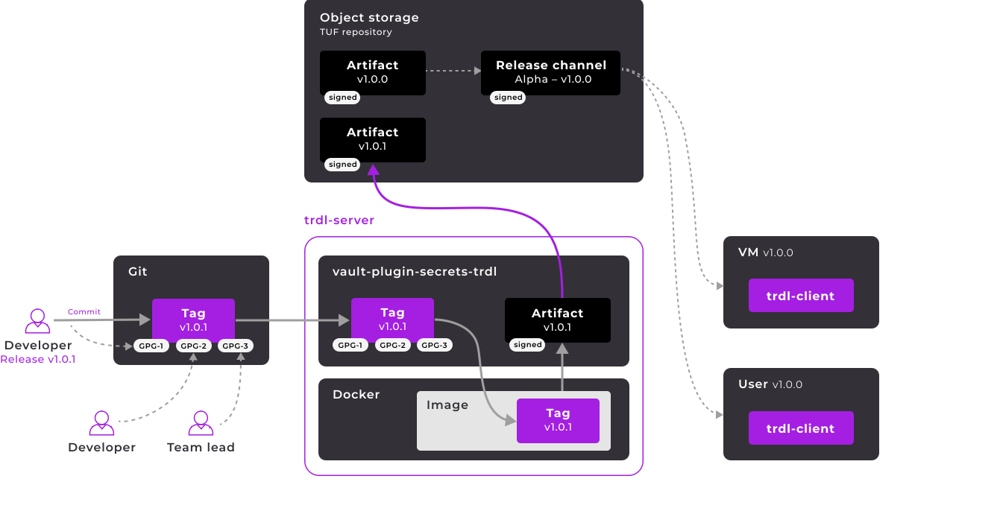
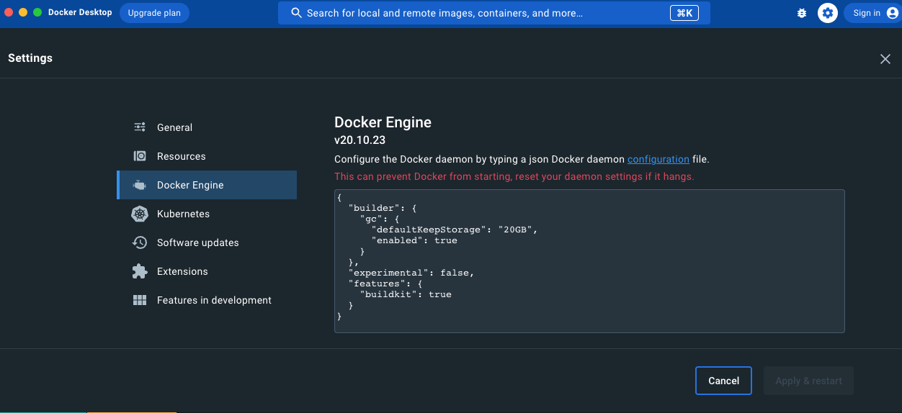

+++
author = "Sangam Biradar"
categories = ["Kubernetes", "2023"]
weight = 10
description = " werf is a CNCF Sandbox CLI tool to implement full-cycle CI/CD to Kubernetes easily. werf integrates into your CI system and leverages familiar and reliable technologies, such as Git, Dockerfile, Helm, and Buildah "
draft = false
slug = "Missing part of your CI/CD system Build Test Deploy Distribute Cleanup"
tags = ["DevOps", "kubernetes", "CI/CD", "cloud native"]
title = " Werf : A solution for implementing efficient and consistent software delivery to Kubernetes facilitating best practices"
[cover]
image = "werf.png"

+++

<center> <a href="https://github.com/werf/werf"></a> </center>

#### Install Werf 

```bash
➜  ~  curl -sSLO https://werf.io/install.sh && chmod +x install.sh
➜  ~ ./install.sh --version 1.2 --channel stable
[INPUT REQUIRED] Current login shell is "zsh". Press ENTER to setup werf for this shell or choose another one.
[b]ash/[z]sh/[a]bort? Default: zsh.
z
[INPUT REQUIRED] trdl is going to be installed in "/Users/sangambiradar/bin/". Add this directory to your $PATH in "/Users/sangambiradar/.zshrc" and "/Users/sangambiradar/.zprofile"? (strongly recommended)
[y]es/[a]bort/[s]kip? Default: yes.
yes
[INFO] Installing trdl to "/Users/sangambiradar/bin/".

[INFO] Adding werf repo to trdl.
[INPUT REQUIRED] Add automatic werf activation to "/Users/sangambiradar/.zshrc" and "/Users/sangambiradar/.zprofile"? (recommended for interactive usage, not recommended for CI)
[y]es/[a]bort/[s]kip? Default: yes.
[INFO] werf installation finished successfully!
[INFO] Open new shell session if you have enabled werf autoactivation or activate werf manually with:
$ source $("/Users/sangambiradar/bin/trdl" use werf "1.2" "stable")
```

### werf use trdl 

trdl is an Open Source solution providing a secure channel for delivering updates from the Git repository to the end user. 




Problems that trdl solves for you
- Continuous delivery limitations
   - Continuous delivery via the CI system works well for the SaaS model, that is, for software 
   - hosted on cloud servers. At the same time, you would be hard-pressed to find a tool that is as   fast at delivering code to user devices.

- Challenges related to implementing a secure delivery
   - What complicates things:
     - Software release and changes in release channels must only occur based on a collective decision of the team (quorum).
     - The system must protect against unauthorized access and data compromise.
     - The system must not be compromised by human mistakes, including regulation breaches.

- Package manager limitations
  - There are many package managers, but they all have common drawbacks:
  - Each platform requires its own manager.
  - The package creation process is complicated.
  - There is a lot of manual work involved: the user has to add the package source, find the package, and install/upgrade/uninstall it.


### verify werf cli installed or not 

```
➜  ~ werf
werf helps to implement and support Continuous Integration and Continuous       
Delivery.

Find more information at https://werf.io

Delivery commands:
  converge        Build and push images, then deploy application into Kubernetes
  dismiss         Delete werf release from Kubernetes
  bundle          Work with werf bundles: publish bundles into container        
                  registry and deploy bundles into Kubernetes cluster

Cleaning commands:
  cleanup         Cleanup project images in the container registry
  purge           Purge all project images in the container registry

Helper commands:
  ci-env          Generate werf environment variables for specified CI system
  build           Build images
  export          Export images
  run             Run container for project image
  kube-run        Run container for project image in Kubernetes
  compose         Work with docker-compose
  slugify         Print slugged string by specified format.
  render          Render Kubernetes templates

Low-level management commands:
  config          Work with werf.yaml
  managed-images  Work with managed images which will be preserved during       
                  cleanup procedure
  host            Work with werf cache and data of all projects on the host     
                  machine
  helm            Manage application deployment with helm
  cr              Work with container registry: authenticate, list and remove   
                  images, etc.
  kubectl         kubectl controls the Kubernetes cluster manager

Other commands:
  synchronization Run synchronization server
  completion      Generate bash completion scripts
  version         Print version

Use "werf <command> --help" for more information about a given command.

Version: v1.2.205
➜  ~ 
```
### Setup Minikube for Werf 

```
 ~ minikube start --vm=true --insecure-registry registry.example.com:80
😄  minikube v1.30.0 on Darwin 13.3 (arm64)
✨  Automatically selected the qemu2 driver. Other choices: virtualbox, ssh
🌐  Automatically selected the builtin network
❗  You are using the QEMU driver without a dedicated network, which doesn't support `minikube service` & `minikube tunnel` commands.
To try the dedicated network see: https://minikube.sigs.k8s.io/docs/drivers/qemu/#networking
💿  Downloading VM boot image ...
    > minikube-v1.30.0-arm64.iso....:  65 B / 65 B [---------] 100.00% ? p/s 0s
    > minikube-v1.30.0-arm64.iso:  330.67 MiB / 330.67 MiB  100.00% 16.06 MiB p
👍  Starting control plane node minikube in cluster minikube
💾  Downloading Kubernetes v1.26.3 preload ...
    > preloaded-images-k8s-v18-v1...:  330.52 MiB / 330.52 MiB  100.00% 16.66 M
🔥  Creating qemu2 VM (CPUs=2, Memory=4000MB, Disk=20000MB) ...
🐳  Preparing Kubernetes v1.26.3 on Docker 20.10.23 ...
    ▪ Generating certificates and keys ...
    ▪ Booting up control plane ...
    ▪ Configuring RBAC rules ...
🔗  Configuring bridge CNI (Container Networking Interface) ...
    ▪ Using image gcr.io/k8s-minikube/storage-provisioner:v5
🔎  Verifying Kubernetes components...
🌟  Enabled addons: storage-provisioner, default-storageclass
🏄  Done! kubectl is now configured to use "minikube" cluster and "default" namespace by default

```
`--insecure-registry` allows usage of Container Registry without TLS.

### add on NGINX Ingress Controller & Container Registry to store images :

```
➜  ~ minikube addons enable ingress
💡  ingress is an addon maintained by Kubernetes. For any concerns contact minikube on GitHub.
You can view the list of minikube maintainers at: https://github.com/kubernetes/minikube/blob/master/OWNERS
    ▪ Using image registry.k8s.io/ingress-nginx/kube-webhook-certgen:v20230312-helm-chart-4.5.2-28-g66a760794
    ▪ Using image registry.k8s.io/ingress-nginx/controller:v1.7.0
    ▪ Using image registry.k8s.io/ingress-nginx/kube-webhook-certgen:v20230312-helm-chart-4.5.2-28-g66a760794
🔎  Verifying ingress addon...
🌟  The 'ingress' addon is enabled
➜  ~ minikube addons enable registry
💡  registry is an addon maintained by Google. For any concerns contact minikube on GitHub.
You can view the list of minikube maintainers at: https://github.com/kubernetes/minikube/blob/master/OWNERS
    ▪ Using image gcr.io/google_containers/kube-registry-proxy:0.4
    ▪ Using image docker.io/registry:2.8.1
🔎  Verifying registry addon...
🌟  The 'registry' addon is enabled
```

### Create Ingress to access Container Registry:

```
ubectl apply -f - << EOF
---
apiVersion: networking.k8s.io/v1
kind: Ingress
metadata:
  name: registry
  namespace: kube-system
  annotations:
    nginx.ingress.kubernetes.io/proxy-body-size: "0"
spec:
  rules:
  - host: registry.example.com
    http:
      paths:
      - path: /
        pathType: Prefix
        backend:
          service:
            name: registry
            port:
              number: 80
EOF

```

### Allow usage of Container Registry without TLS for docker:


```
{
  "insecure-registries" : ["registry.example.com:80"]
}
```
add above configuration key 


```
➜  ~   minikube start --vm=true --insecure-registry registry.example.com:80
😄  minikube v1.30.0 on Darwin 13.3 (arm64)
✨  Using the qemu2 driver based on existing profile
👍  Starting control plane node minikube in cluster minikube
🏃  Updating the running qemu2 "minikube" VM ...
🐳  Preparing Kubernetes v1.26.3 on Docker 20.10.23 ...
🔎  Verifying ingress addon...
    ▪ Using image docker.io/registry:2.8.1
🔎  Verifying Kubernetes components...
    ▪ Using image gcr.io/google_containers/kube-registry-proxy:0.4
🔎  Verifying registry addon...
🌟  Enabled addons: storage-provisioner, ingress, default-storageclass, registry
🏄  Done! kubectl is now configured to use "minikube" cluster and "default" namespace by default

```

### update hostfile and registry name 

```
 ~ echo "$(minikube ip) vote.quickstart-application.example.com result.quickstart-application.example.com registry.example.com" | sudo tee -a /etc/hosts
Password:
10.0.2.15 vote.quickstart-application.example.com result.quickstart-application.example.com registry.example.com
~ minikube ssh -- "echo $(minikube ip) registry.example.com | sudo tee -a /etc/hosts"
10.0.2.15 registry.example.com

```

### lets test out simple voting app 

```
➜  ~ git clone https://github.com/werf/quickstart-application
cd quickstart-application
Cloning into 'quickstart-application'...
remote: Enumerating objects: 1279, done.
remote: Total 1279 (delta 0), reused 0 (delta 0), pack-reused 1279
Receiving objects: 100% (1279/1279), 1.05 MiB | 5.09 MiB/s, done.
Resolving deltas: 100% (515/515), done.

```

#### we have voting , result and working dockerfile in werf.yaml 

```
  quickstart-application git:(main) cat werf.yaml 
configVersion: 1
project: quickstart-application
---
image: vote
dockerfile: Dockerfile
context: vote
---
image: result
dockerfile: Dockerfile
context: result
---
image: worker
dockerfile: Dockerfile
context: worker

```

### werf converge

```
werf converge --repo registry.example.com:80/quickstart-application                                                                             
Version: v1.2.205
Using werf config render file: /private/var/folders/xy/3ssjv1j152x3_0ryt4yb982c0000gn/T/werf-config-render-1406655825

┌ Concurrent builds plan (no more than 5 images at the same time)
│ Set #0:
│ - ⛵ image vote
│ - ⛵ image result
│ - ⛵ image worker
└ Concurrent builds plan (no more than 5 images at the same time)

┌ ⛵ image vote
│ ┌ Copy suitable stage from secondary :local
│ │ Use cache image for vote/dockerfile
│ │      name: registry.example.com:80/quickstart-application:08900098c0a1a06586f8909a6b77927db90bbd21b5a089330ccd6e35-1680637511061
│ │        id: 2cb9949aa002
│ │   created: 2023-04-05 01:15:10 +0530 IST
│ │      size: 51.2 MiB
│ └ Copy suitable stage from secondary :local (33.85 seconds)
└ ⛵ image vote (111.86 seconds)

┌ ⛵ image result
│ ┌ Copy suitable stage from secondary :local
│ │ Use cache image for result/dockerfile
│ │      name: registry.example.com:80/quickstart-application:78557a576585e3acba6868f3d28b70b601affb6364e377918b355f8b-1680637519961
│ │        id: c14efe2c5cae
│ │   created: 2023-04-05 01:15:19 +0530 IST
│ │      size: 53.0 MiB
│ └ Copy suitable stage from secondary :local (43.51 seconds)
└ ⛵ image result (91.21 seconds)

┌ ⛵ image worker
│ ┌ Copy suitable stage from secondary :local
│ │ Use cache image for worker/dockerfile
│ │      name: registry.example.com:80/quickstart-application:f5eab243c67a973041e7f92ee9f5ff39d0d671536814a10bac957e82-1680637550923
│ │        id: 74a6e53feb05
│ │   created: 2023-04-05 01:15:50 +0530 IST
│ │      size: 74.2 MiB
│ └ Copy suitable stage from secondary :local (33.76 seconds)
└ ⛵ image worker (96.56 seconds)

Release "quickstart-application" does not exist. Installing it now.

┌ Waiting for resources to become ready
│ ┌ Status progress
│ │ DEPLOYMENT                                                                                                                                  REPLICAS                  AVAILABLE                    UP-TO-DATE                                      
│ │ db                                                                                                                                          1/1                       0                            1                                               
│ │ │   POD                                                   READY               RESTARTS                   STATUS                             ---                                                                                                    
│ │ └── 6676664f7d-sz6ct                                      0/1                 0                          ContainerCreating                  Waiting for: available 0->1                                                                            
│ │ redis                                                                                                                                       1/1                       0                            1                                               
│ │ result                                                                                                                                      1/1                       0                            1                                               
│ │ vote                                                                                                                                        1/1                       0                            1                                           ↵
│ │     
│ │ worker                                                                                                                                      1/1                       0                            1                                               
│ │ │   POD                                                   READY               RESTARTS                   STATUS                             ---                                                                                                    
│ │ └── 77b4769cd4-qlhkm                                      0/1                 0                          ContainerCreating                  Waiting for: available 0->1                                                                            
│ │ RESOURCE                                                                                                NAMESPACE                         CONDITION: CURRENT (DESIRED)                                                                             
│ │ Service/vote                                                                                            quickstart-application            -                                                                                                        
│ │ Service/db                                                                                              quickstart-application            -                                                                                                        
│ │ Service/redis                                                                                           quickstart-application            -                                                                                                        
│ │ Service/result                                                                                          quickstart-application            -                                                                                                    ↵
│ │     
│ │ Ingress/quickstart-application                                                                          quickstart-application            -                                                                                                        
│ └ Status progress
│ 
  
```

you will see results 
- Go to the following URL to vote: vote.quickstart-application.example.com
- Go to the following URL to check the result of voting: result.quickstart-application.example.com


for more example check it out : https://werf.io/documentation/v1.2/usage/deploy/overview.html 


Join [CloudNativeFolks Community](https://discord.gg/rEvr7vq) or Reach out to me on twitter [@sangamtwts](https://twitter.com/sangamtwts)
